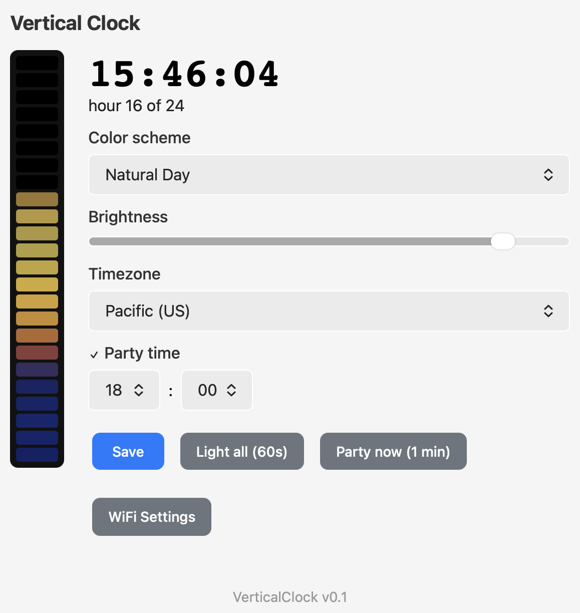

# VerticalClock

An ESP32-C3 that turns a vertical strip of **24 WS2812b LEDs** into a 24-hour
clock. The strip fills from the bottom (hour 1) toward the top (hour 24) as the
day goes by, and the colors follow the sky — deep blue at night, warm hues at
sunrise and sunset, and yellow through the middle of the day. Everything drifts
and breathes gently so the display feels alive rather than static.

The time comes from the internet (NTP); the timezone, color scheme, and
brightness are all chosen from a small built-in web page — no reflashing needed.

- **LED data** on **GPIO 5** (24 × WS2812b, GRB)

WiFi onboarding is handled by [EasyWiFi](https://github.com/brennanMKE/EasyWiFi):
on first boot the device hosts a setup hotspot with a captive portal, so it can
be joined to your network without hard-coding credentials.

---

## How it works

1. On boot, [EasyWiFi](https://github.com/brennanMKE/EasyWiFi) connects to a
   saved WiFi network, or — if none is stored — starts a
   `VerticalClock-Setup-XXXXXX` access point with a captive portal for entering
   credentials.
2. Once online, the firmware configures NTP (`pool.ntp.org` / `time.nist.gov`)
   for the selected timezone.
3. **Reading the time.** The number of lit LEDs is the current hour: at 00:xx one
   LED glows at the bottom; by 23:xx the whole column is lit. The leading LED
   brightens across its hour, so the column grows smoothly rather than jumping.
4. **The color.** Each lit LED is colored by the active scheme at the hour it
   represents, so the column becomes a painting of the day so far — night blue
   below, sunrise, midday yellow, and so on. The topmost (current) LED is always
   the present moment's color.
5. **Feeling alive.** A slow per-LED shimmer drifts every color between nearby
   shades (yellow toward orange and back, etc.), and all changes — hour ticks,
   scheme switches, brightness — ease in over a few seconds rather than snapping.
6. Until the first NTP sync, a calm blue dot rises along the strip to show the
   clock is alive and waiting for time.
7. **Party time.** At a configurable 24-hour time, the clock is suspended for one
   minute and the strip runs a lively show — a fast scrolling rainbow with a beat
   pulse and white sparkles — then returns to the clock on its own.
8. Timezone, color scheme, brightness, and the party time are selectable from the
   device's web page and stored in NVS, so they survive reboots.

---

## Color schemes

Schemes live in [`src/ColorSchemes.cpp`](src/ColorSchemes.cpp). **Natural Day**
is an RGB keyframe table (hour-of-day → real-sky color, so night is genuinely
dim and midday bright). The rest are color themes ported from the **GlowKitchen**
project — FastLED HSV hue palettes spread across the day and blended, so they're
vivid all day long. Built-in:

| Scheme | Feel |
|--------|------|
| **Natural Day** (default) | Night blue → violet pre-dawn → sunrise orange → midday yellow → sunset → twilight |
| **Rainbow** | Full spectrum cycling up the strip |
| **Pink Pony Club** | Pinks, magentas, and hot pink |
| **Ocean Waves** | Deep blues and teal |
| **Sunset** | Warm oranges and pinks into purple |
| **Forest** | Natural greens and earth tones |
| **Green** | Candle-like greens |

---

## Hardware

| Part | Notes |
|------|-------|
| ESP32-C3 dev board | `esp32-c3-devkitm-1` (built-in USB CDC) |
| WS2812b strip | 24 LEDs, mounted vertically (hour 1 at the bottom) |
| 5 V power supply | Sized for the strip; 24 LEDs at full white ≈ 1.4 A |
| 330–470 Ω resistor | In series with the data line (optional but recommended) |
| 1000 µF capacitor | Across 5 V / GND at the strip (optional but recommended) |

### Wiring

```
ESP32-C3 GPIO 5 ──[330 Ω]──▶ DIN (WS2812b)
ESP32-C3 GND ───────────────▶ GND  (must be common with the strip's supply)
5 V supply  ───────────────▶ 5 V
                              └─[1000 µF]─ GND   (near the first LED)
```

> **Power:** drive the strip from a real 5 V supply, not the board's 3V3/USB
> pin, once you have more than a handful of LEDs lit. Tie the supply ground to
> the ESP32 ground so the data signal has a return path.

> **GPIO 5** is an ordinary GPIO on the ESP32-C3 (not a strapping pin), so it is
> safe for the data line. Avoid the strapping pins (GPIO2 / GPIO8 / GPIO9) and
> the USB pins. To use a different pin, change `LED_DATA_PIN` in
> [`src/LedClock.cpp`](src/LedClock.cpp). The LED count is `NUM_LEDS` in
> [`src/LedClock.h`](src/LedClock.h).

---

## Build and flash

This is a [PlatformIO](https://platformio.org/) project.

```bash
# Build
pio run -e esp32-c3

# Build, upload, and open the serial monitor
pio run -e esp32-c3 -t upload -t monitor
```

Key configuration (`platformio.ini`):

- Board: `esp32-c3-devkitm-1`, Arduino framework
- USB CDC serial enabled (`-DARDUINO_USB_MODE=1 -DARDUINO_USB_CDC_ON_BOOT=1`)
- Libraries: `ArduinoJson`, **FastLED**, and **EasyWiFi** (PlatformIO Registry)

---

## First-time WiFi setup (newly flashed board)

A freshly flashed board has no stored WiFi credentials, so it starts in setup
mode:

1. **Power on** the ESP32-C3. It creates a WiFi access point named
   **`VerticalClock-Setup-XXXXXX`** (where `XXXXXX` is from the board's MAC).
2. On your phone or laptop, **join that network**. A **captive portal** opens
   automatically. If it doesn't, browse to `http://192.168.4.1/wifi`.
3. **Scan for networks**, pick your home WiFi, and enter the password.
4. The device saves the credentials and connects; the setup hotspot shuts down.

Credentials are stored on the device, so this is a one-time step. To re-run it,
use **Factory Reset** from the EasyWiFi WiFi page.

---

## Configuring the clock

Once the device is on your WiFi, open its web page (see
[Finding the device](#finding-the-device-on-your-network)).



The page shows:

- A **live preview** of the physical strip (top = hour 24) that mirrors the real
  colors, plus the current time and which hour of 24 it is.
- **Color scheme** — pick from the built-in schemes; applies immediately.
- **Brightness** — a slider (5–255) driving the strip's master brightness.
- **Timezone** — a dropdown of common zones.
- **Party time** — a checkbox to enable it plus 24-hour hour/minute selectors.
  When enabled, the strip throws a one-minute party at that time every day.

Click **Save**; settings apply within about a second and are written to NVS, so
they're restored on every boot (defaults: Natural Day, brightness 140, Pacific,
party off at 18:00).

Two buttons below the form run on the device immediately and return to the clock
on their own: **Light all (60s)** (full-strip color preview) and
**Party now (1 min)** (test the party show without waiting for the scheduled
time).

Built-in zones: Pacific, Mountain, Arizona (no DST), Central, Eastern (US), UK /
Ireland, Central Europe, and UTC. To add more, edit `TIMEZONE_OPTIONS[]` in
[`src/ClockPages.cpp`](src/ClockPages.cpp) — each entry is a human label plus a
[POSIX TZ string](https://www.gnu.org/software/libc/manual/html_node/TZ-Variable.html)
(which encodes its own DST rules, so the time stays correct year-round).

---

## Finding the device on your network

The device advertises itself over **mDNS / Bonjour**. Its address is its name
plus the last three bytes of its MAC, for example:

```
http://verticalclock-52b4a4.local/
```

On Apple devices you can usually just type that `.local` address into a browser.
If you don't know the MAC suffix, use the included finder script.

### `find-clock.sh`

A zsh script (macOS) that browses for the device via `dns-sd` and prints a
ready-to-open URL:

```bash
./find-clock.sh              # finds hosts whose name starts "verticalclock"
./find-clock.sh myprefix     # use a different name prefix
OPEN=1 ./find-clock.sh       # also open the first match in your browser
```

---

## Project structure

```
VerticalClock/
├── platformio.ini        # Board, build flags, FastLED/EasyWiFi/ArduinoJson deps
├── find-clock.sh         # macOS mDNS finder for the device
├── VerticalClock.png     # Screenshot of the web configuration page
└── src/
    ├── main.cpp          # Setup/loop: EasyWiFi, NTP, drives the LED clock @60fps
    ├── LedClock.h        # LedClock: renders the 24-LED bar, shimmer + blending
    ├── LedClock.cpp      #   - per-hour palette colors, eased animation
    ├── ColorSchemes.h    # ColorScheme: hour-of-day -> color keyframe tables
    ├── ColorSchemes.cpp  #   - Natural Day, Aurora, Ember, Ocean + sampleScheme()
    ├── ClockPages.h      # ClockPages: web UI (CustomPageHandler)
    └── ClockPages.cpp    #   - GET /      controls + live strip preview
                          #   - POST /save persist + apply tz/scheme/brightness
                          #   - GET /state JSON {valid,time,hour,leds[]} for the UI
```

---

## Troubleshooting

- **`nvs_get_str ... NOT_FOUND` on first boot** — harmless. It just means no
  setting has been saved yet, so the defaults are used. It does not appear after
  you save.
- **Strip is dark or only the first LED works** — check the data line goes to
  **DIN** (not DOUT), that grounds are common between the ESP32 and the 5 V
  supply, and that `NUM_LEDS` matches your strip.
- **Colors look wrong (red/blue swapped)** — your strip may use a different color
  order; change `GRB` in the `FastLED.addLeds<...>` call in
  [`src/LedClock.cpp`](src/LedClock.cpp).
- **Flicker** — usually power: add the 1000 µF capacitor and the series resistor,
  and use a supply with enough headroom.
- **Clock shows `waiting for network time…`** — the device hasn't completed an
  NTP sync yet. Confirm it's on WiFi with internet access; the first sync usually
  takes a few seconds after connecting.
```
